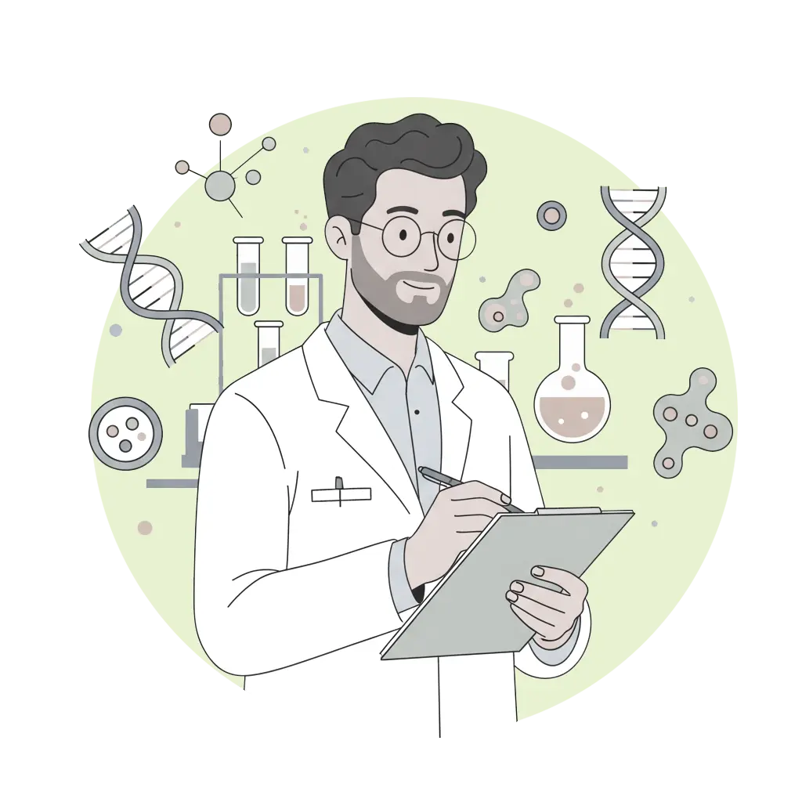

::: {.home-container}
::: {.home-grid-parent}
::: {.home-grid-child-left}

# Epigenomics Data Analysis: from Bulk to Single Cell

This workshop is an introduction to best practice bioinformatics methods for 
processing, analyses and integration of epigenomics data. The online teaching 
includes lectures, programming tutorials and interactive group sessions.

---

::: small
Updated:   at  .
:::

:::
:::{.home-grid-child-right}

{.nolightbox}

:::
:::
:::
